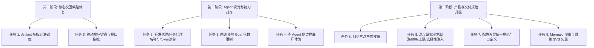

# Miyu Agent · Main 待办事项系统设计与落地规划

> 本文档针对 [`todolist.md`](../../../todolist.md) 中的 `## Main` 清单逐项进行了代码级根因分析、改造方案设计及工程权衡论证，严格遵循 Miyu 项目的工程哲学（唯物实证、前缀即契约、上帝文件绝迹、单向分层架构）。

---

## 目录

1. [WebUI Artifact 图片拖拽放大迟滞与错位修复](#1-webui-artifact-图片拖拽放大迟滞与错位修复)
2. [子代理名称体系规范化与实时 Token 读秒展示](#2-子代理名称体系规范化与实时-token-读秒展示)
3. [彻底移除 Goal 目标任务的轮数限制](#3-彻底移除-goal-目标任务的轮数限制)
4. [子 Agent 详细行为侧边工作区展开（延续预览形态）](#4-子-agent-详细行为侧边工作区展开延续预览形态)
5. [对话完成气泡中产物交互按钮与主动预览恢复](#5-对话完成气泡中产物交互按钮与主动预览恢复)
6. [WebUI 移动端软键盘顶屏与整页拖动漂移深度修复](#6-webui-移动端软键盘顶屏与整页拖动漂移深度修复)
7. [设置-界面「配色方案」统一规范定义与自定义扩展](#7-设置-界面配色方案统一规范定义与自定义扩展)
8. [深度研究（Deep Research）学术规范、时长上限与选择性记忆注入](#8-深度研究deep-research学术规范时长上限与选择性记忆注入)
9. [前端支持 Mermaid 图表渲染与原生 SVG 矢量呈现](#9-前端支持-mermaid-图表渲染与原生-svg-矢量呈现)

---

## 1. WebUI Artifact 图片拖拽放大迟滞与错位修复

> **已被 plan 修订(2026-09-14)**:「按 `1/(UI_SCALE*zoom)` 投影」是错的——translate 写在 scale 之前,不被放大,再除 zoom 图只跟手一半。拖拽过渡与 `UI_SCALE` 换算 2026-09-12 已修,先复现再改。见 `../../plan-is-true/2026-09-14/webui-delivery.md` §1。

### 现存代码与现象分析
* **代码位置**：[`web/app.js`](../../../web/app.js#L5540-L5575)、[`web/styles.css`](../../../web/styles.css#L4875-L4905)
* **现存现象**：当在 Artifact 预览区打开图片并放大（`artifactZoom > 1`）后，按住鼠标左键拖拽平移图片时，画面明显跟不上鼠标（严重迟滞感），松手或移动时画面会跳变漂移（错位）。
* **根本原因**：
  1. **CSS 过渡残留（Transition 干扰）**：在 [`web/styles.css`](../../../web/styles.css#L4884) 中给 `.artifact-image-stage > img` 设置了 `transition: transform 160ms cubic-bezier(0.2, 0, 0, 1)`。虽然有 `.is-dragging > img { transition: none; }`，但在 `pointerdown` 到类名生效、浏览器样式重算之间存在竞态，且拖拽结束松开的一瞬间立即触发回弹过渡。
  2. **缺少 `requestAnimationFrame` 节流**：[`web/app.js`](../../../web/app.js#L5558-L5565) 在原生 `pointermove` 的高频事件中同步修改内联样式并重置类名，引起严重的掉帧和微卡顿。
  3. **坐标变换与缩放基准点错位**：
     - `applyTransform` 采用 `translate(${panX}px, ${panY}px) scale(${zoom})`，而 CSS 默认设置了 `transform-origin: center top`。
     - 同时，桌面端 `.app-shell` 启用了全局 `zoom: var(--ui-scale)`（1.1 倍缩放），[`visualPixelsToLayout`](../../../web/app.js#L44-L46) 与元素局部缩放体系叠加后，导致拖拽位移向量 $\Delta x, \Delta y$ 无法与屏幕物理光标绝对同步。

### 可能要做的方案
1. **拖拽期间硬性剔除 CSS 动画**：在拖拽阶段直接通过内联样式 `image.style.transition = 'none'` 确保无过渡；仅在滚轮或按钮缩放时开启平滑过渡。
2. **rAF 帧调度合并渲染**：
   ```javascript
   let panRaf = null;
   stage.addEventListener("pointermove", (event) => {
     if (!stage.classList.contains("is-dragging")) return;
     const dx = (event.clientX - startX) / (UI_SCALE * state.artifactZoom);
     const dy = (event.clientY - startY) / (UI_SCALE * state.artifactZoom);
     nextPanX = originPanX + dx;
     nextPanY = originPanY + dy;
     if (!panRaf) {
       panRaf = requestAnimationFrame(() => {
         panRaf = null;
         applyTransform();
       });
     }
   });
   ```
3. **变换矩阵统一与原生手感对齐**：使用 `transform-origin: 0 0` 或统一为标准双轴居中 `center center`，拖拽增量严格按照 `1 / (UI_SCALE * zoom)` 投影，确保鼠标抓取点始终锁死在图像同一像素上。
4. **防止原生拖拽拦截**：为 `` 显式设置 `draggable="false"`，避免触发浏览器默认的图片拖拽外壳。

### 为什么这样做
图片放大后的平移是最高频的交互之一。消除 CSS 动画竞争与坐标放大比误差，才能让画面像原生桌面图片查看器一样“抓手即走、指哪打哪”。

---

## 2. 子代理名称体系规范化与实时 Token 读秒展示

> **已被 plan 修订(2026-09-14)**:子代理 stats 2026-09-12 起已每步推送,不用再改后端;「开发中」有三处要一起改。见 `../../plan/2026-09-14/agent-runtime.md` §2。

### 现存代码与现象分析
* **代码位置**：[`web/app.js`](../../../web/app.js#L7940-L7950)、[`web/app.js`](../../../web/app.js#L8195-L8240)、[`src/tools/subagent_runner.rs`](../../../src/tools/subagent_runner.rs#L650-L665)
* **现存现象**：
  1. 当前前端对于子代理工具卡片的标题判断为：`dev === true ? "开发中" : "子代理"`，语义偏向动词状态而非实体角色，且刷新回放历史时常回退为裸技术名。
  2. 运行时只有后台任务条有 Token 显示，前台工具卡的 Token 在刷新或某些执行阶段缺失，且未能与耗时读秒紧凑贴合在每一步实时刷新。

### 可能要做的方案
1. **统一角色实体命名**：
   - 凡是开启 `dev: true`（代码、工程、Bug 排查等研发任务）的子代理，统一固定命名为 **`开发代理`**。
   - 凡是普通子代理（通用任务派发），统一固定命名为 **`任务代理`**。
   - 彻底废止 `开发中` 这种动态用词，使其与 Miyu 的 Agent 身份契约对齐。
2. **时间与 Token 紧贴式排布与逐步刷新**：
   - 在 [`web/app.js`](../../../web/app.js#L8235) 中微调 DOM 结构：`[图标] [代理类型·标题] [耗时 12s · ≈1.4k tokens] [窥视摘要] [状态]`。
   - 在 [`src/tools/subagent_runner.rs`](../../../src/tools/subagent_runner.rs#L662) 中，子代理每执行完一步推理或工具调用，立刻向 `progress` 推送 `__subagent_stats__` 增量；前端捕获后即时刷新对应 `tool-task-token`。
   - 历史回放时（`call.sub_trace` 播种），从已存储的最后一条 stats 中还原该子代理的最终消耗，保证回看历史与实时执行排版 100% 同构。

### 为什么这样做
“开发代理”与“任务代理”明确区分了 Agent 的能力边界与安全沙盒权限（开发代理拥有修改工程代码与执行测试的授权，任务代理偏重信息检索与分析）。把 Token 和时间捆绑展示，可以让用户一目了然地获知当前步骤的模型计算开销与运行效率。

---

## 3. 彻底移除 Goal 目标任务的轮数限制

> **已被 plan 修订(2026-09-14)**:驱动器 2026-09-11 起已跳过 `max_rounds = 0` 的判定;真正的残留在提示词 `Round N of 0` 与两份 schema。见 `../../plan/2026-09-14/agent-runtime.md` §3。

### 现存代码与现象分析
* **代码位置**：[`src/state/conversation_db/goals.rs`](../../../src/state/conversation_db/goals.rs#L135)、[`src/tools/goal/prompt.rs`](../../../src/tools/goal/prompt.rs#L50-L75)、[`src/web/goal_driver.rs`](../../../src/web/goal_driver.rs#L255-L270)、[`src/tools/descriptions/goal.json`](../../../src/tools/descriptions/goal.json#L26-L30)
* **现存现象**：
  - 历史版本虽然将 `DEFAULT_MAX_GOAL_ROUNDS` 设为了 `0`（表示不限），但很多关键路径依然残留着硬上限限制。
  - 在 [`src/tools/goal/prompt.rs`](../../../src/tools/goal/prompt.rs#L54) 中，当 `max_rounds == 0` 时，提示词直接格式化为 `Round 1 of 0`，使大模型产生“已超限”或“分母为零”的严重语义困惑，诱发模型过早自报放弃或产生幻觉。
  - 数据库字段与接口参数中仍残存 `max_goal_rounds`，容易触发无意义的 `RoundsExhausted` 报错。

### 可能要做的方案
1. **彻底移除轮数上限逻辑**：
   - 废弃 `GoalRecord` 和 SQLite 中的 `max_rounds` 计数截断机制；若保留字段仅用于向下兼容只读，不再阻断执行。
   - 从 [`src/tools/descriptions/goal.json`](../../../src/tools/descriptions/goal.json) 中移除 `max_goal_rounds` 传参声明，降低工具 Schema 的复杂度。
2. **优化提示词生成契约**：
   - 修改 [`goal_round_prompt`](../../../src/tools/goal/prompt.rs#L50)：
     - 从 `Round {} of {}` 改造为 `Round {} (autonomous)`。
     - 明确指示目标直到达成（`complete`）或遇到阻碍（`blocked`）才会终止，去除数字上限对模型的心理暗示。
3. **依赖已有安全网替代机械轮数限制**：
   - Miyu 已有双重防跑飞防护：
     1. **连续空转自动暂停**（模型仅说话未调用工具即挂起，见 [`finish_run`](../../../src/web/goal_driver.rs#L60)）。
     2. **连续受阻门槛**（[`BLOCKED_AFTER_CONSECUTIVE_ROUNDS = 3`](../../../src/tools/goal/mod.rs#L38)）。
     3. **Armed 仅存驻内存**（重启或异常即暂停）。因此完全不需要机械的轮数硬性阈值。

### 为什么这样做
Goal 本身就是为了解决“长程复杂目标自主推进”而设计的。机械的轮数限制会导致长任务在跑了一半时无故中断，迫使人类再次手动唤醒；移除轮数限制后，Agent 可以在安全网监控下持续攻关，直至真正完成任务。

---

## 4. 子 Agent 详细行为侧边工作区展开（延续预览形态）

### 现存代码与现象分析
* **代码位置**：[`web/app.js`](../../../web/app.js#L7738)、[`web/app.js`](../../../web/app.js#L8345-L8380)、[`src/tools/deep_research/mod.rs`](../../../src/tools/deep_research/mod.rs)
* **现存现象**：
  - 用户反馈：“子 agent 目前点击后只能看到 `thinking_depth: medium topic: ...` 这种简略信息，应该改成点击后可以查看具体行为，可延续预览文件这种侧边打开的效果”。
  - **根因分析**：
    1. [`isSubagentTool`](../../../web/app.js#L7738) 只识别了 `subagent` 和 `task`，没有识别 `deep_research` 或插件类子任务。因此这类任务被当成了普通工具处理，点击仅仅是展开了一个存放原始 JSON 参数的文本块（`argumentsDetail`）。
    2. 主聊天流内行内展开高度有限（约 5 行左右），无法承载多轮深入调研的几十次搜索、思考链与工具调用。

### 可能要做的方案
1. **扩展子任务识别范围**：
   - 将 `deep_research`、`linux_input_method_diagnose` 等调研与诊断插件统一纳入子过程事件通道，捕获完整的 `sub_trace` 和步骤详情。
2. **侧边工作区（Artifact Workspace）能力扩展**：
   - 复用已有的右侧边栏（[`#artifactWorkspace`](../../../web/index.html#L304)），在现有的 `file / image / markdown` 预览模式外，新增一种 **`subagent_trace`（子任务视窗）** 视图。
3. **点击交互升级**：
   - 点击子代理卡片或任务条上的详情按钮时，不再只是局促地在消息流内行内折叠展开，而是**直接拉开右侧工作区**。
   - 右侧工作区按时间线全屏高度展示该子代理的：
     - **任务目标与初始 Prompt**
     - **完整的思考流（Reasoning Timeline）**
     - **所有的子工具调用入参、过程与产出结果**
     - **最终产出总结**
4. **与主流双向联动**：左侧点击某一步骤，右侧侧边栏自动高亮并平滑定位至对应的子动作。

### 为什么这样做
长任务/子代理往往包含海量的中间过程。挤在左侧主对话气泡内会割裂聊天阅读体验，而借用成熟的右侧抽屉，既拥有全屏纵向浏览的高密度空间，又与“文件预览”的操作习惯保持高度一致。

---

## 5. 对话完成气泡中产物交互按钮与主动预览恢复

> **已被 plan 修订(2026-09-14)**:不需要新落库——后端已按回合分组产物,前端已拿到 `turn.artifacts`(没有 `message.artifacts` 这个字段),纯前端即可。见 `../../plan-is-true/2026-09-14/webui-delivery.md` §5。

### 现存代码与现象分析
* **代码位置**：[`web/app.js`](../../../web/app.js#L5084-L5145)、[`web/app.js`](../../../web/app.js#L8530-L8555)、[`web/index.html`](../../../web/index.html#L261)
* **现存现象**：
  - 目前 Artifact 的生成依靠实时事件自动触发右侧抽屉（`setArtifactWorkspaceOpen(true)`），并在顶部导航栏留有一个微小的图标 [`artifactToggleButton`](../../../web/index.html#L261)。
  - 一旦用户不小心点击右上角关闭了右侧预览，在当前消息气泡正文下方**没有任何交互卡片可以重新打开该产物**，用户在长对话中回溯时极易迷失。

### 可能要做的方案
1. **消息气泡挂载产物卡片（Artifact Pills / Cards）**：
   - 在回合渲染完成或收到产物生成事件时，在对应的助手回复气泡底部（或附件插槽内），渲染直观的产物卡片：
     ```html
     <div class="message-artifact-bar">
       <button type="button" class="artifact-chip-button" data-artifact-id="...">
         <span class="icon">📄</span>
         <span class="name">系统架构分析报告.md</span>
         <span class="action-hint">点击在侧栏预览</span>
       </button>
     </div>
     ```
2. **交互语义对齐**：
   - 点击该产物卡片等价于触发主动预览：设置 `selectedArtifactId` 并调用 `setArtifactWorkspaceOpen(true)`，同时在右侧侧栏平滑切换到该文件。
3. **回放与历史持久化保持**：
   - 即使页面重新加载，通过落库的历史回合事件（`message.artifacts` 列表）同样将这批产物按钮稳定渲染在消息底部。

### 为什么这样做
产物是由特定的对话回合孕育的，它的物理交互入口理应锚定在该回合消息之后。用户关闭侧栏后，可以在消息流中随时通过点击按钮无缝重新调出预览，形成完美闭环。

---

## 6. WebUI 移动端软键盘顶屏与整页拖动漂移深度修复

> **已被 plan 修订(2026-09-14)**:在 `html, body` 上写 `touch-action: none` 会让聊天区整个滚不动(生效值是祖先链的交集);`.chat-scroll-container` 不存在。先定位机型与浏览器。见 `../../plan/2026-09-14/mobile-viewport.md` §6。

### 现存代码与现象分析
* **代码位置**：[`web/index.html`](../../../web/index.html#L5)、[`web/styles.css`](../../../web/styles.css#L230-L260)、[`web/app.js`](../../../web/app.js#L12950-L12975)
* **现存现象**：
  1. 移动端点击输入框后，整个页面向上严重滚动脱离可视范围，屏幕上只露出一片背景色。
  2. 页面在手机上手指滑动时，整个 WebUI 外壳可以被拖动移位（产生橡皮筋拖拽或整体晃动），误触体验差。
* **根本原因**：
  - iOS Safari / Android Chrome 在输入框获焦时，即使设置了 `overflow: hidden`，浏览器仍会触发全局 `window.scrollIntoView()` 尝试将光标居中。
  - 在 [`web/styles.css`](../../../web/styles.css#L230)，`html, body` 没有强制设置 `position: fixed`。移动端只要存在非 fixed 的 `body`，弹性手势就会带动整个窗口发生物理位移。
  - [`syncAppHeight`](../../../web/app.js#L12961) 在移动端调整 `--app-height` 时，虽然尝试通过 `window.scrollTo(0, 0)` 复位，但与浏览器默认的获焦滚屏产生严重冲突与死循环。

### 可能要做的方案
1. **移动端绝对定死视口外壳**：
   ```css
   @media (max-width: 836px) {
     html, body {
       position: fixed;
       top: 0;
       left: 0;
       right: 0;
       bottom: 0;
       width: 100%;
       height: 100%;
       overflow: hidden;
       overscroll-behavior: none;
       touch-action: none; /* 顶层全局禁止任何橡皮筋拖动 */
     }
     .chat-scroll-container, .settings-content {
       touch-action: pan-y; /* 仅允许内容区单向纵向滚动 */
       -webkit-overflow-scrolling: touch;
       overscroll-behavior-y: contain;
     }
   }
   ```
2. **拦截破坏性原生滚动**：
   - 为输入框（`composerText`）添加 `focus` 监听，配合 `preventScroll: true`：
     ```javascript
     elements.composerText.addEventListener("focus", (event) => {
       window.scrollTo(0, 0);
       // 依靠 visualViewport 的 resize 驱动布局，禁止 window 自身产生 scrollY
     });
     ```
3. **基于 VisualViewport 的平稳底栏贴合**：
   - 键盘弹出时，仅动态计算 `visualViewport.height` 并赋给内部消息滚屏容器，而顶栏和底栏始终固定在可视视口边界，不再让 `window` 发生位移。

### 为什么这样做
WebUI 在移动端的目标是实现媲美原生 App 的稳定感。将外壳彻底 `position: fixed` 并隔离触摸行为，可以彻底根绝误触导致的画布晃动与键盘顶飞问题。

---

## 7. 设置-界面「配色方案」统一规范定义与自定义扩展

> **已被 plan 修订(2026-09-14)**:页面有 CSP,往页面注入 `<style>` 不生效(2026-09-10 实测);改为后端把方案编译成 css 文件,复用 matugen 的 `<link>` 切换。见 `../../plan/2026-09-14/color-schemes.md` §7。

### 现存代码与现象分析
* **代码位置**：[`web/index.html`](../../../web/index.html#L592-L600)、[`web/app.js`](../../../web/app.js#L680-L720)、[`src/web/ui_prefs.rs`](../../../src/web/ui_prefs.rs#L18-L25)、[`src/web/server.rs`](../../../src/web/server.rs#L685)
* **现存现象**：目前配色方案写死为 `madobe` 与单文件探测式的 `matugen`。设置面板无添加、编辑、删除入口，无法满足用户个性化配色的需求。

### 可能要做的方案
1. **确立统一配色方案规范（JSON Schema）**：
   - 规定每个方案必须成对提供 `dark` 与 `light` 的完整 MD3 Token 映射表（`primary`, `secondary`, `tertiary`, `surface` 系列）。
   - 规定铁律：`--link`（超链接）与 `--tok-*`（代码高亮）**严禁跟随配色方案改动**，保护用户对可读性和语法高亮的肌肉记忆。
2. **后端配置持久化 API**：
   - 文件落盘于 `~/.miyu/config/color-schemes.json`。
   - 提供 `GET /api/ui/color-schemes` 和 `POST /api/ui/color-schemes` 接口。
   - 扩展 [`SYNCED_KEYS`](../../../src/web/ui_prefs.rs#L18)，允许 `colorScheme` 存储自定义方案的 ID。
3. **前端运行时动态样式编译**：
   - 在 HTML 中开辟 `<style id="customColorSchemeStyle"></style>`。
   - 用户切换自定义方案时，前端将方案中的 Token 动态编译为 CSS 规则并挂载，无需重启 Daemon。
4. **设置界面 UI 交互**：
   - 色卡列表支持动态渲染与删除操作。
   - 增加 `[+ 添加配色]` 弹窗，支持“输入主色自动生成全套 MD3 Token”与“粘贴规范 JSON 导入”双模式。

### 为什么这样做
与系统解耦、基于标准 MD3 Token 的架构，既赋予了用户极高的可玩性，又不会因为乱填颜色导致按钮文字不可见或代码块无法辨识。

---

## 8. 深度研究（Deep Research）学术规范、时长上限与选择性记忆注入

> **已被 plan 修订(2026-09-14)**:WebUI 渲染器不认 `[^1]`,要先补脚注渲染;「访问日期」要在注册时记录,「置信度」没有数据来源不能编;执行摘要 / 局限性会改变输出内容,不做模板强插。见 `../../plan/2026-09-14/research-report.md` §8。

### 8.1 报告学术规范与标准脚注重构

#### 现存代码与现象分析
* **代码位置**：[`src/tools/deep_research/prompts.rs`](../../../src/tools/deep_research/prompts.rs#L7-L35)、[`src/tools/deep_research/report.rs`](../../../src/tools/deep_research/report.rs#L95-L160)
* **现存现象**：
  - 用户反馈：“深度研究的报告应该统一标准，增加脚注等学术规范的行为，但输出内容不受影响，变的只是输出的规范”。
  - 目前系统通过 `[W1]`, `[K1]`, `[R1]` 自定义标记，并在文末简单拼接一个 `## 参考资料` 无序列表。这种格式在标准 Markdown 阅读器、论文排版工具中无法作为真正的超链接脚注跳转，学术感较弱。

#### 可能要做的方案
1. **“变规范而不改内容”的核心原则**：
   - **保持上游模型自由度**：思索者（Thinker）模型的推理过程、论证逻辑、关键观点完全不变，依旧正常引用来源。
   - **在报告生成层（Post-Processor）进行学术化转换**：
     由 [`src/tools/deep_research/report.rs`](../../../src/tools/deep_research/report.rs) 的后处理函数对最终 Markdown 进行统一的学术规范重整。
2. **规范化学术改造细节**：
   - **标准 Markdown 脚注语法与 WebUI 补纯 DOM 双向锚点**：
     - 正文统一重编号为 `[^1]`、`[^2]`。
     - 为 WebUI 的 `renderMarkdown` 增加原生脚注解析支持，生成 `<sup class="md-footnote"><a href="#fn-1">1</a></sup>` 与文末双向回跳锚点。
     - 产出的 Markdown 原始文档保证单一事实源，在 Obsidian、Typora、GitHub 中均具备标准超链接双向跳转能力。
   - **GB/T 7714-2015 格式参考文献列表**：
     - 来源注册时记录真实的 `accessed_at` 时间戳（绝不虚构访问日期）。
     - 文末编译为标准脚注定义：
       ```markdown
       [^1]: [文献/网页标题](URL). 访问日期: 2026-09-14. 抓取摘要: ...
       ```
   - **平台端出站降级适配**：
     - QQ / Telegram 端在消息发送前执行轻量转换，将 `[^1]` 降级为行内 `[1]` 并附紧凑文本列表，避免产生 Markdown 标记噪音。

---

### 8.2 整次研究总时长上限 600 秒（Deadline 控制与兜底成稿）

#### 现存代码与现象分析
* **代码位置**：[`src/tools/deep_research/mod.rs:113`](../../../src/tools/deep_research/mod.rs#L113)、[`src/config/defaults.rs`](../../../src/config/defaults.rs)
* **现存现象**：
  - 用户要求“深度研究上限提升至 600”。实际排查发现深度研究目前**没有任何总时长上限**，轮数不限时可能无限跑下去。
* **改造方案**：
  1. **配置项扩展**：在 `plugins.deep_research` 中新增 `max_total_seconds`（默认 600，0 为不限），设置面板新增对应输入项。
  2. **总时长 Deadline 监控**：研究启动时计算全局 `deadline`。每一轮审视/起草循环前检查剩余时间；正在进行的模型流与工具执行用 `tokio::time::timeout` 限制在剩余预算内。
  3. **超时收拢机制**：
     - **已有草稿**：直接进入 `normalize_final_answer` 成稿，文末诚实标注 *“研究在 600 秒上限处收尾，第 N 轮审视未完成”*。
     - **尚未生成有效草稿**：**给予一次 +60 秒宽限的紧急收尾机会**。强制沉思者进入“无工具模式”，仅基于内存中已注册的现有资料立即快速成稿收敛，避免用户等待近 10 分钟却空手而归。

---

### 8.3 深度调研与主会话记忆隔离及选择性注入

#### 现存代码与现象分析
* **代码位置**：[`src/tools/descriptions/deep_research.json`](../../../src/tools/descriptions/deep_research.json)、[`src/tools/deep_research/prompts.rs`](../../../src/tools/deep_research/prompts.rs)、[`src/prompts/miyu.md`](../../../src/prompts/miyu.md)
* **运行原理排查**：
  - **底层完全隔离**：沉思者与审视者不挂载记忆库（`memory_store`），也不加载主会话的 `<associative-memory>`，工具链中不包含任何记忆读写工具。
  - **委派层存在污染隐患**：目前 `deep_research` 工具仅有单一入参 `topic`。主 AI 在主会话中拥有所有日常闲聊、主观偏见与情感记忆，在缺乏纪律约束时，极易将主观记忆混杂在 `topic` 中直接污染深度研究的学术客观中立性。
* **改造方案（建议选择性注入）**：
  1. **参数契约拆分**：在 `deep_research.json` 中区分：
     - `topic`：纯客观课题或研究命题。声明必须保持学术中立，严禁夹带个人闲聊或主观情绪。
     - `context`（可选）：**选择性注入**客观前置约束（如用户的特定系统环境、硬件规格、明确技术栈要求）。仅在研究结论强依赖该约束时提供。
  2. **提示词规范注入**：
     - `thinker_prompt` 中将 `context` 作为单独的“前置背景与约束条件（必须遵循）”块注入给沉思者。
  3. **主系统提示词纪律约束**：
     - 在 [`src/prompts/miyu.md`](../../../src/prompts/miyu.md) 的工具使用规范中增补纪律：严禁将主观记忆带入深度研究，仅允许选择性注入强相关的客观环境事实。

---

## 9. 前端支持 Mermaid 图表渲染与原生 SVG 矢量呈现

> **已被 plan 修订(2026-09-14)**:SVG 与 mermaid 不进主文档——2026-09-11 已定「活性内容一律进沙箱 iframe」;mermaid 主题变量也不能传 `var(--…)` 字符串,要先取计算后的色值。见 `../../plan-is-true/2026-09-14/webui-delivery.md` §9。

### 现存代码与现象分析
* **代码位置**：[`web/app.js`](../../../web/app.js#L4277-L4300)（`codeBlock`）、[`web/app.js`](../../../web/app.js#L4512-L4540)（`renderMarkdown`）、[`web/app.js`](../../../web/app.js#L5739-L5745)（`renderArtifactPreview`）
* **现存现象**：
  1. **Mermaid 缺失渲染引擎**：当前端渲染 ````mermaid` 代码块时，只能当作普通代码高亮纯文本输出，用户面对大段架构图、时序图、甘特图源码无法直接查阅图形，体验极其原始。
  2. **SVG 产物降级为普通像素位图**：
     - 在 Artifact 预览中，`image/svg+xml` 被简单包装在 `` 标签内。无法通过鼠标选择 SVG 内部文字，无法与矢量元素交互，放大后受制于容器光栅化限制。
     - 在 Markdown 聊天正文中，模型输出的 SVG 代码块无法以原生矢量图元内联挂载，只能以纯代码呈现。

### 可能要做的方案

#### A. Mermaid 动态按需渲染引擎接入
1. **轻量化/按需加载策略**：
   - 遵循 Miyu 的“零无效膨胀”约束，不将数十 MB 的庞大渲染包一股脑塞入首屏。采用惰性加载模式：当聊天消息流或 Artifact 首次扫描到 `language === "mermaid"` 且已完成闭合（`settled === true`）时，动态加载 local vendor 资产或通过轻量 ES 模块初始化：
     ```javascript
     if (language === "mermaid" && settled) {
       renderMermaidBlock(wrapper, codeText);
     }
     ```
2. **“图表 / 源码”双模切换容器**：
   - 为 Mermaid 块封装专属交互头（Toolbar）：
     - 默认展示**渲染后的 SVG 图表视图**。
     - 增加视图切换按钮 `[图表 / 源码]`，满足开发者随时复制原始 DSL 语法的需求。
     - 增加 `[复制 SVG]` 与 `[全屏/侧栏查看]` 交互。
3. **自适应主题调色盘（Theming Synchronization）**：
   - Mermaid 的渲染初始化参数需动态绑定 Miyu 的 MD3 主题变量（`dusk` 暗色 vs `dawn` 亮色）：
     ```javascript
     mermaid.initialize({
       startOnLoad: false,
       theme: state.theme === "linen" ? "neutral" : "dark",
       themeVariables: {
         darkMode: state.theme !== "linen",
         background: "transparent",
         primaryColor: "var(--md-sys-color-primary-container)",
         primaryTextColor: "var(--md-sys-color-on-primary-container)",
         lineColor: "var(--line-strong)"
       }
     });
     ```
4. **流式状态保护（Streaming Guard）**：
   - 在流式输出过程中（`settled === false`，围栏尚未闭合），**严禁触发 Mermaid 解析**（否则不完整语法会疯狂报错并使页面闪烁），仅展示代码草稿；待围栏闭合瞬间一次性编译生成 SVG。

#### B. 原生 SVG 矢量渲染与 Artifact 工作区融合
1. **Markdown 正文支持 SVG 矢量渲染**：
   - 识别 ````svg` 代码块或安全受信任的 `<svg>` 标签。
   - 默认直接挂载原生 `<svg>` 节点，并提供 `[矢量图 / 源码]` 切换栏。
2. **Artifact 侧边工作区升级原生矢量渲染**：
   - 当 `artifact.mime === "image/svg+xml"` 或以 `.svg` 结尾时：
     - 不再使用 `<div class="artifact-image-stage"></div>`。
     - 切换为专属的 **`artifact-svg-stage`** 容器，将 SVG 文本注入为原生 DOM 树。
     - **无级矢量缩放**：缩放时直接调整 SVG 的 `viewBox` 或利用矢量无损缩放，文字无锯齿、线条永远锐利。
     - **支持图元点击与文本选中**：用户可直接复制架构图里的文字节点。
3. **安全沙盒与 XSS 消毒（Security Discipline）**：
   - 严格遵循 Miyu 的系统安全哲学：在注入原生 `<svg>` 前，必须执行确定性的 SVG 净化（剔除 `<script>`, `onload`, `onerror`, `javascript:` URI 等任何动态执行通道），严防恶意代码借矢量图侵入 WebUI 本地沙盒。

### 为什么这样做
1. **多模态认知的质感飞跃**：现代 AI 编程与系统设计（例如系统架构、时序图、状态机推演）绝大部分使用 Mermaid 与 SVG 作为视觉交付载体。直接渲染图形让交互体验从“纯文本终端”迈入“现代化 IDE 协同工作台”。
2. **矢量无损与主题纯粹性**：相比将图表转成位图 png，SVG 矢量不仅传输体积极小（节省 Token 和网络带宽），而且在高分屏（Retina / 4K）上无级缩放毫不模糊，还能天然融入 WebUI 的暗亮色主题。

---

## 落地推进优先级建议



* **第一优先级（阻塞级体验 Bug）**：任务 1、任务 6（直接解决用户的操作挫败感与移动端不可用问题）。
* **第二优先级（交互与核心机制理顺）**：任务 2、任务 3、任务 4（明晰子代理权责，释放 Goal 自主推演潜能，提升可观察性）。
* **第三优先级（专业度与交付形态升级）**：任务 5、任务 7、任务 8、任务 9（完善 WebUI 的产物闭环、深度报告学术质感，以及现代化 Mermaid/SVG 矢量渲染）。
